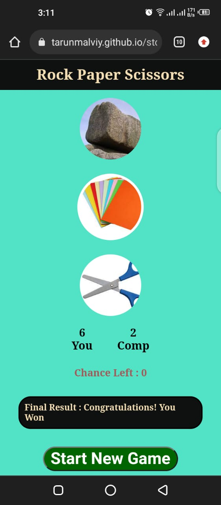
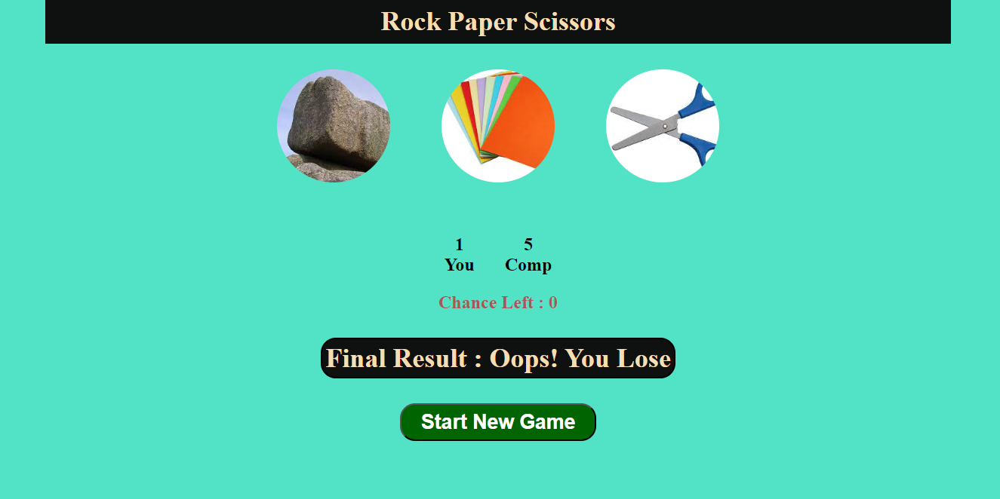

# Rock Paper Scissors Game

## Description
This is a simple Rock Paper Scissors game built using HTML, CSS, and JavaScript. Players can choose between Rock, Paper, and Scissors, and the game keeps track of the scores and the number of chances left.

## Mobile View


## Computer view


## Technologies Used
- **HTML**: Structure of the game interface.
- **CSS**: Styling and layout of the game components.
- **JavaScript**: Game logic and interactivity.

## Algorithm Used

decode = {
        '1': 'rock',
        '0': 'paper',
        '-1': 'scissor',
    }

                         L     W     W      L     W     L                           
        # player(P)      -1    0     1      0     -1     1
        # computer(C)     1    1     -1    -1     0      0
         C-P              2    1     -2     -1    1      -1   

### So, here player only win when C-P result is -2 and 1 


## How to Play
1. Click on one of the three options: Rock, Paper, or Scissors.
2. The computer will make its choice randomly.
3. The game will display the results and update the scores.
4. You have 10 chances to play the game.

## Demo
You can play the game [here](https://tarunmalviy.github.io/stone-paper-scissors-game/).

## Installation
To run this project locally:
1. Clone this repository:
   ```bash
   git clone https://github.com/your-username/rock-paper-scissors.git
